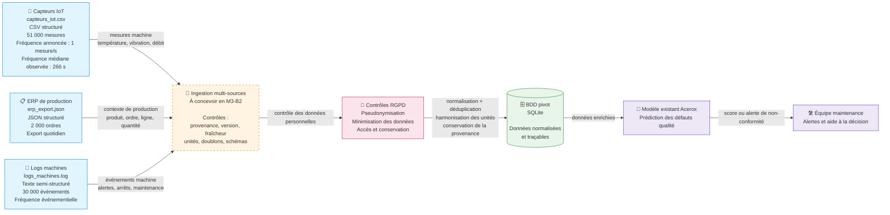

# Schéma des flux de données — Acerox Métallurgie

> Ce schéma représente les sources identifiées, leur passage par une future couche d’ingestion et de normalisation, leur stockage dans une base pivot, puis leur consommation par le modèle existant de prédiction des défauts qualité.

## Schéma

## Légende

* **Producteurs :** les capteurs IoT produisent les mesures physiques, l’ERP fournit le contexte des ordres de production et les machines génèrent les logs événementiels.
* **Traitement intermédiaire :** la future ingestion devra conserver la provenance, vérifier la fraîcheur, harmoniser les unités, gérer les doublons et documenter les versions.
* **Protection des données :** les identifiants de salariés doivent être supprimés ou pseudonymisés lorsqu’ils ne sont pas nécessaires.
* **Stockage :** la BDD pivot regroupera des données normalisées, traçables et prêtes à être utilisées.
* **Consommateur final :** le modèle Acerox produit une alerte ou un score destiné à l’équipe de maintenance.

## Contraintes critiques

* La fréquence annoncée des capteurs — une mesure par seconde — n’est pas confirmée dans l’extrait : l’intervalle médian observé est de 266 secondes.
* Les températures extrêmes du capteur `SROU-L3-T01` doivent être confirmées avant ingestion.
* Les identifiants machines ne sont pas uniques entre les sites : la provenance doit être intégrée dans la clé.
* Les températures du site B doivent être converties de Fahrenheit vers Celsius.
* `debit_l_min` n’est pas disponible dans l’export du site B.
* Le croisement de `ouvrier_id`, `operator_login`, du site, de la ligne et de l’heure peut permettre de réidentifier un salarié.

## Décisions associées

* **Sources retenues en priorité :**

  * les capteurs IoT, car ils décrivent directement l’état physique des machines ;
  * l’ERP, car il apporte le contexte des ordres de fabrication ;
  * les logs machines, après documentation et structuration de leurs événements.

* **Sources écartées :**

  * aucune des trois sources principales n’est définitivement écartée ;
  * les logs sont placés en seconde priorité, car leur intégration est plus complexe et présente davantage de risques de suivi individuel.

* **Source bonus — rapports techniques `.md` :**

  * non traitée dans cette analyse ;
  * elle pourra être évaluée ultérieurement pour un cas d’usage documentaire ou RAG, mais elle n’est pas nécessaire au premier enrichissement du modèle tabulaire existant.

* **Traçabilité :**

  * chaque donnée devra conserver au minimum sa source, sa date d’extraction, sa fraîcheur, sa version et son unité d’origine.

---

*Schéma produit par Fernando, le 21 juillet 2026, dans le cadre du brief M3-B1 Acerox Métallurgie.*

